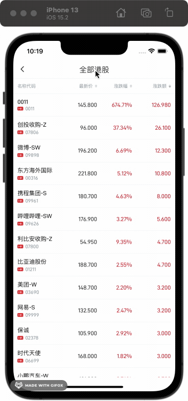
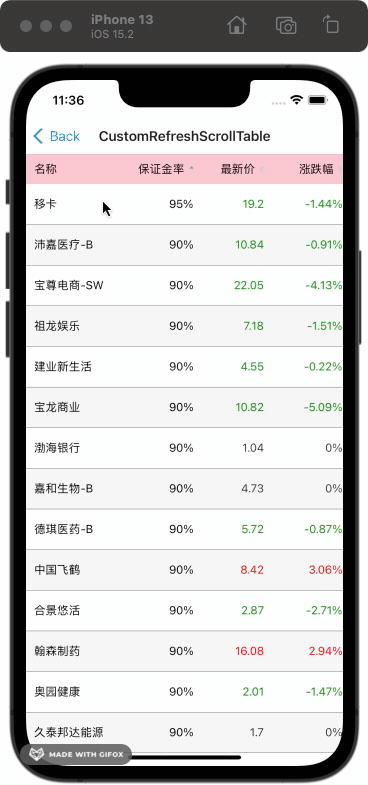

# react-native-scrollview-table
This is a react native scrolling table with thead and left first column fixed, suitable for android and ios

## Installation
__android__

```bash
yarn add react-native-react-native-scrollview-table
```
or

```
npm install react-native-react-native-scrollview-table
```

__ios__
```bash
cd ios && pod install
```

## Basic usage
```javascript
import ScrollTable from 'react-native-scrollview-table';

<ScrollTable
  data={dataSource}
  columns={columns}
/>

```

scrollTable





## props
<font size=4 color='red'>props extends native ScrollViewProps</font>

| Name                | Type                                                          | Default             | Description               |
|---------------------|---------------------------------------------------------------|---------------------|---------------------------|
| data                | object[]                                                      | -                   | *required                 |
| columns             | [ColumnsType[]](#columns)                                     | -                   | *required                 |
| rowHeight           | number                                                        | 40                  | A unified line height     |
| loading             | boolean \| undefined                                          | -                   |                           |
| refreshing          | boolean                                                       | -                   |                           |
| horizontalScroll    | boolean                                                       | -                   |                           |
| pagination          | [Ipagination](#page)                                          | {}                  |                           |
| styles              | [Istyle](#Istyle)                                             | {}                  |                           |
| emptyConfig         | [EmptyPropsType](#empty)                                      | text: 'no data'     |                           |
| restScollView       | extend Native ScrollViewProps                                 | -                   |                           |
| rowStyle            | function(index?: number) => ViewStyle;                        | -                   | custom a row of style     |
| onChange            | function(pagination: Ipagination, order: Isort) => void;      | -                   | Paging and sorting table, must with pagination |
| onRefresh           | function() => void;                                           | -                   |                           |
| onRowPress          | function(item: any, index: number) => void;                   | -                   |                           |
| renderFooter        | function() => ReactNode;                                      | -                   |                           |

<span id='columns'></span>
```typescript
interface Icolumns {
  dataIndex: string;
  title?: string | ReactNode;
  flex?: number; // first col is the percentage of the screen width,otherwise is on the right side of the width of the scroll area percentage
  style?: ViewStyle; // teble cell style
  sorter?: Iorder;
  sortEmpty?: boolean;
  sortHeaderAlign?: HeaderAlign;  // only control order col style
  render?: (value?: string | number, item?: any) => string | ReactNode;
}
```
<span id='page'></span>
```typescript
type Ipagination {
  pageIndex: number; // required
  pageTotal: number; // required
  startIndex: number; // required The start page paging (somebody like start start with 0)
}
```
<span id='Istyle'></span>
```typescript
type Istyle {
  theaderStyle?: ViewStyle;
  tbodyStyle?: ViewStyle;
}
```
<span id='empty'></span>
```typescript
interface EmptyPropsType {
  style?: ViewStyle,
  extra?: React.ReactNode;
  image?: NodeRequire;
  imageStyle?: ImageStyle;
  text?: string;
  textStyle?: TextStyle;
}
```

```typescript
type HeaderAlign = 'flex-start' | 'flex-end' | 'center';
type IjustifyContent = "flex-start" | "flex-end" | "center" | "space-between" | "space-around" | "space-evenly";
type Iorder = "" | "asc" | "desc";
```
